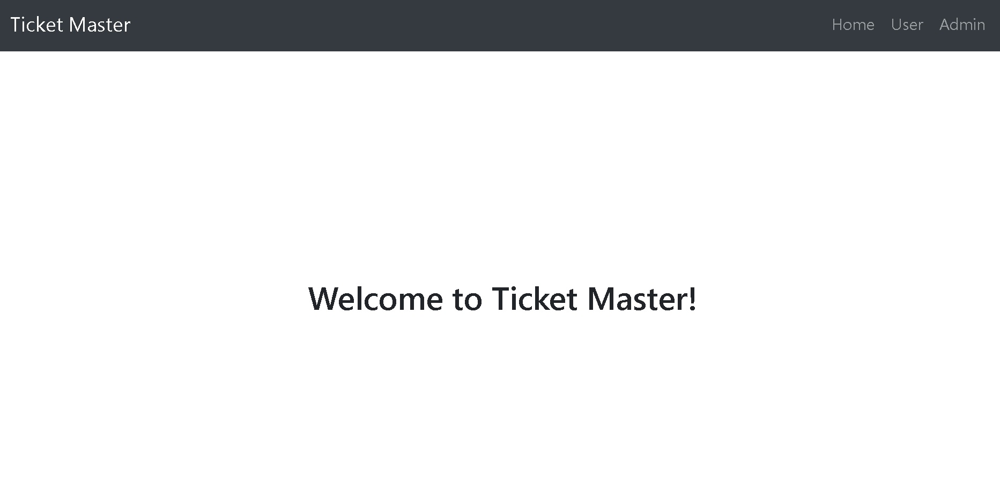

# Ticket Master

This is my first attempt to use Spring Boot for demonstrating backend skills.

A tester can view front-end as a User or as an Admin.

As a User a tester can book a predefined events.

As an Admin, a tester can view all the bookings. Can create new events. Can modify or delete the existing events.

There are some conditions for creating an event such as; An event name should be greater than 3 characters. All these conditions are demonstrated in demo video and in the API documentation. 

### Demo Video

### How to build a project

#### Back End
1.	Clone/ download this github repository. `https://github.com/ghaniasim/ticket-master.git`
2. Extract it on your local machine.
3. Import backend folder in IntelliJ IDEA as a maven project.
4. Write your PostgreSQL username and password in src -> main -> resources -> application.properties.
5. Run application.

#### Front End
1. Clone/ download this github repository.
2. Extract it on your local machine.
3. Open frontend/ ticket_master folder in vscode.
4. Run `npm install` to download all the dependencies.
5. Run `npm start` to run the project.

#### API Documentation
**NOTE** This link will only work when the backend project is up and running on your local machine.
<http://localhost:8080/swagger-ui.html>

<image src="images/swagger.jpg" width=800>
  
#### User Stories
* Book Ticket:   
  * As a user I want to book an event so that I do not have to wait in the queue to get in. 
    * I want to see the list of all events. 
    * I want to provide my name age and email. 
    * I want a confirmation that event has been booked. 
      * Age must be greater than 13 to book an event. 
      * Email should be correctly formatted. 
      * First name must be of minimum  2 characters.
      
* Create event:  
  * As an admin I want to create an event so that users can book for the event. 
    * Event should be in the future. 
    * Event name must be greater than 3 characters. 

* Modify event: 
  * As an admin I want to modify an existing event. 
    * Event should be in the future. 
    * Event name must be greater than 3 characters. 
    
* Delete event: 
  * As an admin I want to delete an event. 
    * A booked event can not be deleted.
    
* Bookings: 
  * As an admin I want to see the list of bookings. 
  * As an admin I want to see the person's details who booked an event.
  
#### Limitations
* Shortcomings in front end. 
  * Front end is only desinged for a success path since this project is a demonstration of backend skills. 
  
* Shortcomings in back end. 
  * Not all data validations added. Just a few to demonstrate skills e.g; 
    * Events can have duplicate name etc. 
    
* No testing added due to lack of time.
